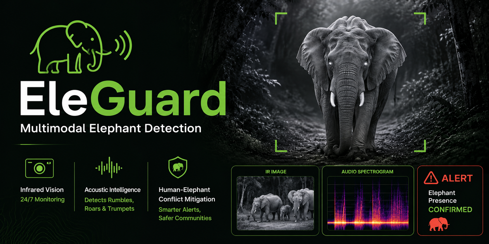
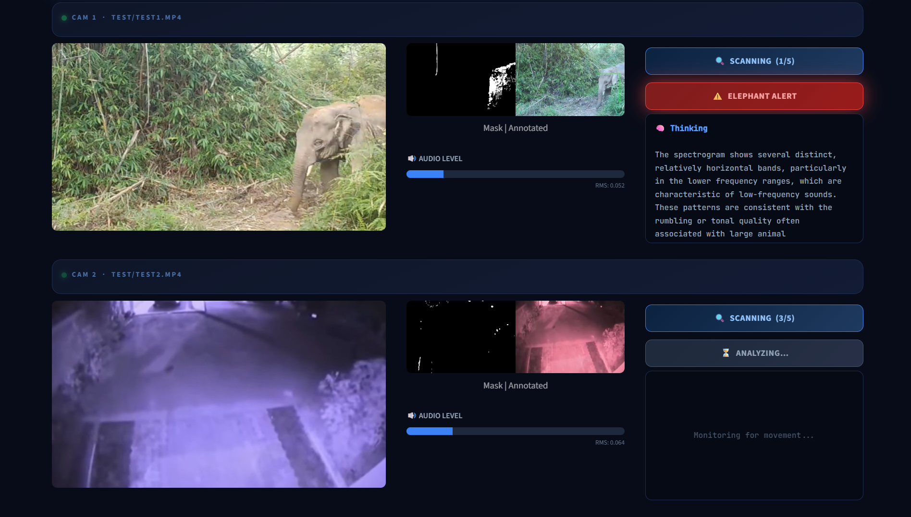
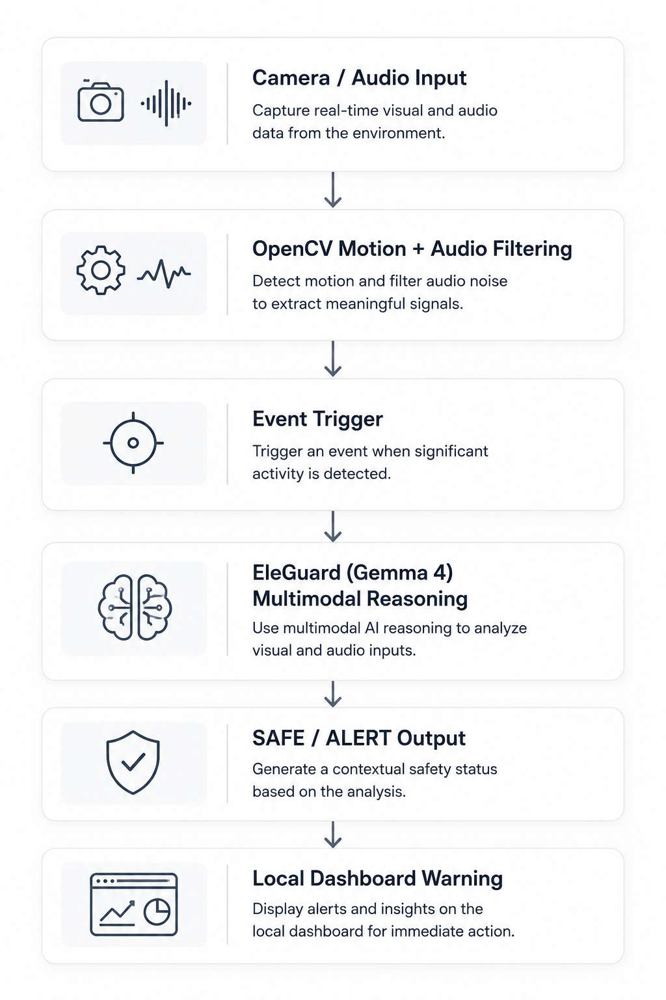
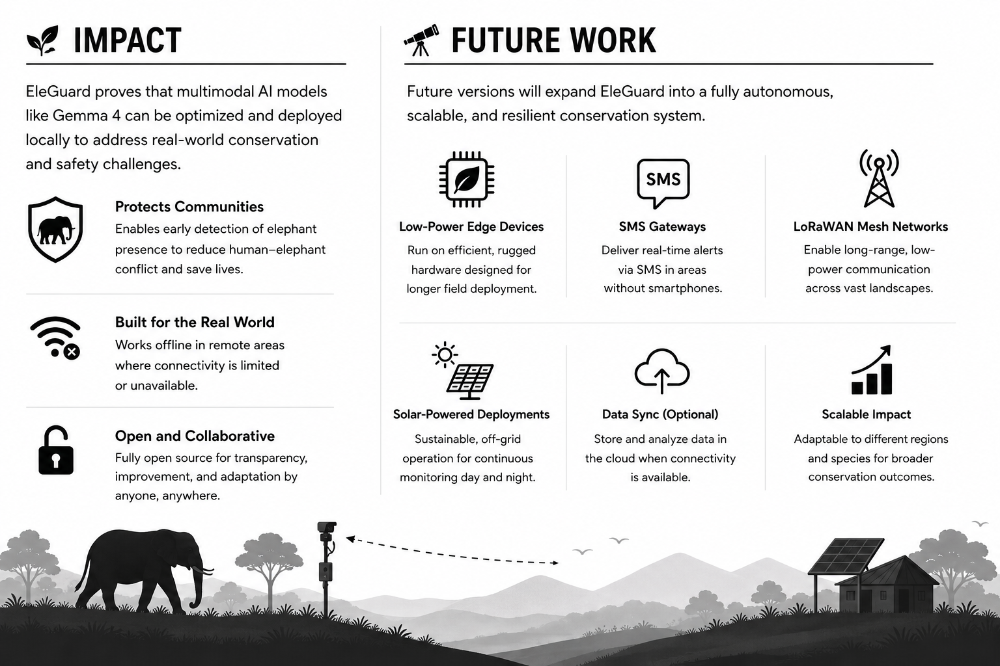

# 🐘 EleGuard: Multimodal Elephant Detection

EleGuard is an intelligent wildlife surveillance system designed for the 24/7 monitoring and detection of elephant activity in natural habitats. This project is a submission for the [Gemma 4 Good Hackathon](https://www.kaggle.com/competitions/gemma-4-good-hackathon/overview) and focuses on local, offline deployment to mitigate human-elephant conflict in rural communities across Sri Lanka.

EleGuard is a model trained on a dataset based on Gemma 4 E2B.
<p align="center">
  
</p>

## Features
* Multimodal Detection: Integrated visual (Infrared/Daytime) and acoustic analysis for robust monitoring.
* Reasoning Distillation: Utilizes expert logic derived from Gemini 3.1 Flash to provide contextual safety alerts.
* Edge-Optimized: Built for offline, CPU-only execution on standard hardware using llama.cpp.
* Low-Connectivity Ready: Designed for resource-constrained environments with no cloud dependency.

## Technical Architecture
The system uses a Teacher-Student Knowledge Distillation framework to achieve high intelligence in a small footprint.

1. The Teacher Model: Gemini 3.1 Flash analyzed 2,600 samples to generate detailed "thought blocks" explaining visual and acoustic features.
2. The Student Model (EleGuard): Based on Gemma 4 E2B, fine-tuned using the Unsloth framework to internalize this expert reasoning.

## EleGuard Dashboard
The dashboard provides a real-time interface built with Streamlit.
* Multi-Camera Support: Simultaneous monitoring of multiple video feeds.
* Motion Filtering: OpenCV-based tracking and camera shake suppression.
* Local Inference: Connects to a local llama.cpp server for offline processing.
<p align="center">
  
</p>

## How It Works
To ensure reliable, 24/7 monitoring without overwhelming edge hardware, EleGuard is structured as an event-driven inference cascade. By using lightweight heuristics to filter raw environmental data, the system ensures the compute-intensive Gemma 4 reasoning model is only triggered during high-probability events. The complete pipeline, from sensor capture to local alert generation, is illustrated below.
<p>
  
</p>

## Installation and Usage
### 1. Clone the repository:
```Bash
git clone [https://github.com/MalithaBandara/EleGuard.git](https://github.com/MalithaBandara/EleGuard.git)
cd EleGuard
```

### 2. Install dependencies:
```Bash
pip install opencv-python streamlit librosa numpy moviepy requests
```
### 3. Download llama.cpp
To run the local inference server, you need the llama.cpp binaries. It is recommended to use **build b9090** or newer for full Gemma 4 multimodal support.
1. Go to the [llama.cpp Releases page](https://github.com/ggml-org/llama.cpp/releases).
2. Look for **Release b9090** (or the latest version).
3. Download the specific zip for Windows CPU: `llama-b9090-bin-win-cpu-x64.zip`.
4. Extract the contents of the zip file.

### 4. Download Model Weights (GGUF)
Download the following required files from the [EleGuard Hugging Face Repository](https://huggingface.co/MalithaBandara/EleGuard):

* **`EleGuard-gemma-4-E2B-it.Q4_K_M.gguf`** (Main Model)
* **`EleGuard-gemma-4-E2B-it.F16-mmproj.gguf`** (Vision Projector)

Place these files in your project root or a known directory (e.g., **`C:\EleGuard`**).

### 5. Start the Local Inference Server
Run the llama.cpp server on port 8080. \
**Note:** You must update the three paths in the command below to match the actual locations on your system (the server executable, the model file, and the vision projector).

```bash
# Ensure you update the paths below to point to your local files
C:\EleGuard\llama-b9090-bin-win-cpu-x64\llama-server.exe -m C:\EleGuard\gemma-4-e2b-it.Q4_K_M.gguf --mmproj C:\EleGuard\gemma-4-e2b-it.F16-mmproj.gguf -c 512 -ngl 0 --host 127.0.0.1 --port 8080
```

### 6. Launch the Dashboard:
```Bash
python -m streamlit run app.py
```
## Resources
* **Model Weights (GGUF)**: Fine-tuned weights and multimodal projectors are hosted on [Hugging Face](https://huggingface.co/MalithaBandara/EleGuard).
* **Dataset**: The model was trained on the [EleGuard Dataset](https://www.kaggle.com/datasets/malithabandara/eleguard-dataset), which contains 2,600 curated samples of infrared/daytime imagery and bioacoustic spectrograms.

## Legal and Trademarks
* Gemma is a trademark of Google LLC.
* EleGuard is a model trained on a dataset based on Gemma 4 E2B.
* This project is independently developed and is not an official Google release.
<p align="center">
  
</p>
